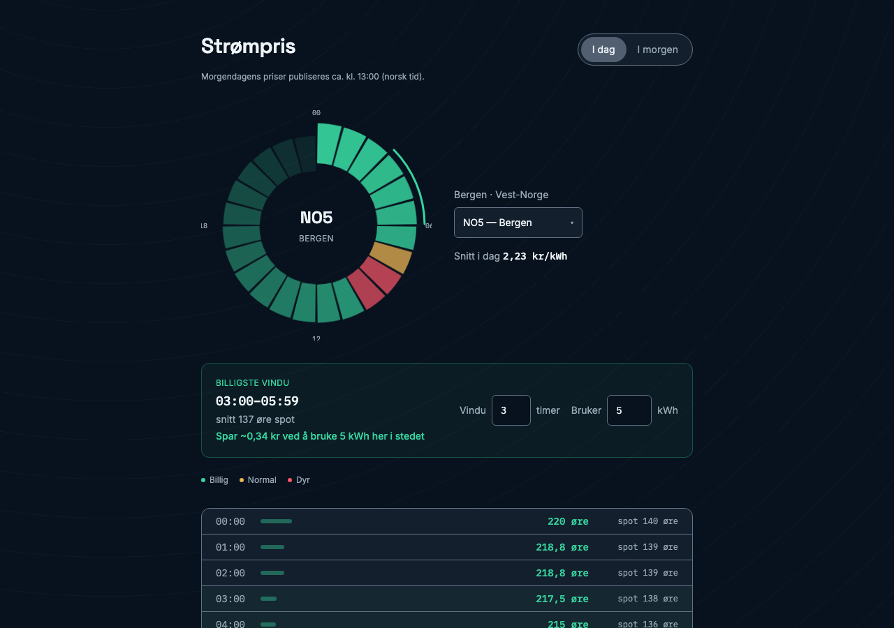

# Strømpris

[](https://github.com/Hammadniazi/strompris-dashboard/actions/workflows/ci.yml)

**Live demo:** [strompris-dashboard.vercel.app](https://strompris-dashboard.vercel.app/)



A live electricity spot-price checker for Norway. Shows hourly prices for
today (and tomorrow, once published) across all five price zones, what you
actually pay after VAT, supplier markup, and grid rent, and the cheapest
contiguous window to run an appliance.

Data comes from the public [hvakosterstrommen.no](https://www.hvakosterstrommen.no/)
API — no API key or backend required.

## Features

- Hourly spot prices for zones NO1–NO5, color-coded cheap/normal/expensive
  relative to the day's own range
- Effective price: spot + VAT (NO4 is VAT-exempt) + markup + grid rent,
  adjustable in Settings
- Cheapest N-hour window finder
- Today/tomorrow toggle (tomorrow's prices publish ~13:00 Oslo time)
- Zone, cost settings, and window length persist across visits
- Shareable per-zone URLs (e.g. `/no1`)

## Running it

```bash
npm install
npm run dev       # start the dev server
npm run build     # type-check and build for production
npm run preview   # preview the production build locally
```

## Testing

```bash
npm run typecheck    # type-check only, no emit
npm run test         # unit/component tests, watch mode
npm run test:run     # unit/component tests, single run
npm run test:coverage
npm run test:e2e     # Playwright, against a production build
npm run lint
```

## Stack

Vite, React 19, TypeScript, Tailwind CSS v4, TanStack Query, Zod. Tests with
Vitest, Testing Library, MSW, and Playwright.

## Notable decisions

**Validation at the network boundary.** The API is a third party I don't
control, so responses are parsed through a Zod schema before they reach any
component. Types are inferred from the schema, so the runtime check and the
compile-time type can't drift apart.

**Norwegian days aren't always 24 hours.** `osloTomorrow` originally added
86,400,000 ms and re-read the Oslo date. On the night before spring-forward
that overshoots by a day, because the following Oslo calendar day is only 23
real hours long. It now steps the calendar day forward in UTC instead.
`src/lib/time.test.ts` covers both DST transitions.

**A 404 is a state, not an error.** Tomorrow's prices don't exist before
~13:00, and history stops at 2021-12-01. Both surface as a typed
`PriceUnavailableError`, and React Query's retry is skipped specifically for
that error — retrying a "not published yet" 404 can't ever succeed, so it
surfaces immediately instead of after 3 rounds of backoff. Real transient
failures (server errors, network issues) still get the default retry.

**VAT is zone-dependent.** NO4 (Nord-Norge) is MVA-exempt, so effective price
is computed per zone rather than with a flat 25%.

**Accessibility.** Norway's accessibility regulation (implementing the EU Web
Accessibility Directive) sets WCAG 2.1 AA as the bar for public-sector and
many commercial digital services — the same standard is followed here. The
gauge carries its data in `aria-label`; the price list never signals level by
colour alone (bar width and the number itself carry the same information
independent of colour perception); the day toggle exposes `aria-pressed`;
live regions announce changes when zone or window length updates.

## License

[MIT](LICENSE)

## Author

**Hammad Khan** — [@Hammadniazi](https://github.com/Hammadniazi)
